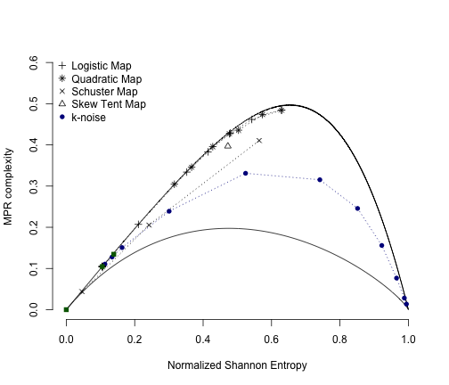

<!-- This is the project specific website template -->
<!-- It can be changed as liked or replaced by other content -->

<html>
<body>

<!-- R-Forge Logo -->


<table border="0" width="100%" cellspacing="0" cellpadding="0">
<tr>
<td>

</td> 
</tr>
</table>

<!-- get project title  -->
<!-- own website starts here, the following may be changed as you like -->

<h1>Welcome to Statistical Complexity Measures!</h1>
<em><p><strong>statcomp: An R package to quantify statistical complexity and information of time series to distinguish chaos from noise.
</strong> </p></em>

<!-- menu -->
<hr>
<h2>Contents</h2>
<ul>
  <li><a href="index.html">statcomp: Introduction and Installation</a></li> 
  <li>statcomp - applications and examples:</li>
  <ul>
		<li><a href="statcomp_example1.html">Tutorial 1: Classification of Deterministic-chaotic and stochastic processes using the Entropy-Complexity (HxC) plane </a></li>
    <li><a href="statcomp_example2.html">Tutorial 2: Classification of Deterministic-chaotic and stochastic processes using the Entropy-Fisher (HxF) plane </a></li>
	</ul>
	<li><a href="http://r-forge.r-project.org/projects/statcomp/">Project summary page</a></li>
</ul>
<hr>
<!-- end of menu -->

- Load packages:

```r
library(statcomp)
library(fNonlinear)
library(fArma)
```

- Define local function to get complexity:

```r
get.complexity <- function(x, ndemb = 6, rank_transform = T) {

# if rank_transform=T, lehmer-permutation scheme is used (i.e. following Olivares et al. 2012, Physica A 391 (2012) 2518-2526)
# if rank_transform=T, keller-permutation scheme is used (see e.g. Olivares et al. 2012, Physica A 391 (2012) 2518-2526)
# the transformation of ranks is OPTIONAL, but is included here

  if (rank_transform == T) {
    # get ranks matrix of the "lehmerperm"-matrix in Olivares' paper:
    transform_lehmer = transformPermCoding(target_pattern=t(apply(X=generate_lehmerperm_matrix(ndemb=6), MARGIN=1, FUN=rank_to_permutation)), ndemb=6)
    opd = ordinal_pattern_distribution(x=x, ndemb = ndemb)[transform_lehmer]
    wpe = weighted_ordinal_pattern_distribution(x=x, ndemb = ndemb)[transform_lehmer]
  } else {
    opd = ordinal_pattern_distribution(x=x, ndemb = ndemb)
    wpe = weighted_ordinal_pattern_distribution(x=x, ndemb = ndemb)
  }
    
  return(c(permutation_entropy(opd), MPR_complexity(opd), fis(opd),
           permutation_entropy(wpe), MPR_complexity(wpe), fis(wpe)))
}
```

- **Calculate simple chaotic maps and noise processes:**

```r
# Parameter vectors for chaotic maps:
logistic.par = seq(3, 4, 0.1)
quadratic.par = seq(1.4, 2, 0.1)
schuster.par = c(5/2,2,3/2)
skew_tent.par = 0.1847

# noise processes:
knoise.par = seq(0,5, 0.5)
fbm.par = seq(0.1, 0.9, 0.2)
fgn.par = seq(0.1, 0.9, 0.2)
```

- Logistic map

```r
# https://en.wikipedia.org/wiki/Logistic_map
# http://www.sciencedirect.com/science/article/pii/0167278983902981
logistic.complexity = sapply(X=logistic.par, FUN=function(par) get.complexity(x= logistic_map(N=10^5, r=par, disregard_N=10^5), ndemb=6))
```

- Quadratic map:

```r
# http://www.sciencedirect.com/science/article/pii/0167278983901264
quadratic.complexity = sapply(X= quadratic.par, FUN=function(par) get.complexity(quadratic_map(N= 10^4, k=par)))
```

- Schuster map:

```r
schuster.complexity = sapply(X=schuster.par, FUN=function(par) get.complexity(schuster_map(N= 10^4, z=par, disregard_N=10^3)))
```

- Skew Tent

```r
skew_tent.complexity <- sapply(X=skew_tent.par, FUN=function(par) get.complexity(x=skew_tent_map(N=10^4, a=par, disregard_N=10^3), ndemb = 6))
```

- Henon Map

```r
henon_ts = henon_map(N=10^4, disregard_N=1000)
henon.complexity.x <- get.complexity(x=henon_ts$x_ts, ndemb = 6)
```

```
## Error in if (prob >= 1e-30) return(prob * log(prob)) else return(0): missing value where TRUE/FALSE needed
```

```r
henon.complexity.y <- get.complexity(x=henon_ts$y_ts, ndemb = 6)
```

```
## Error in if (prob >= 1e-30) return(prob * log(prob)) else return(0): missing value where TRUE/FALSE needed
```

- knoise

```r
knoise.complexity = sapply(X= knoise.par, FUN=function(par) get.complexity(x=powernoise(k=par, N=10^4)[[1]], ndemb=6))
```

- fbm

```r
fbm.complexity = sapply(X= fbm.par, FUN=function(par) get.complexity(x=fbmSim(n = 10^4, H = par, method = "circ", fgn=F, doplot=F), ndemb = 6))
```

- fgn

```r
fgn.complexity = sapply(X= fgn.par, FUN=function(par) get.complexity(x=fbmSim(n = 10^4, H=par, method="circ", fgn=T, doplot=F), ndemb = 6))
```

- Simple processes:

```r
const.complexity = get.complexity(x=1:10^4, ndemb = 6)
updown.complexity = get.complexity(x=rep(c(-1, 1), 10^4/2), ndemb = 6)
sine.complexity = get.complexity(x=sin(rep(seq(0, 2*pi, length.out = 365), 10^4/12)), ndemb = 6)
```

- Plot time causal information planes: Entropy-Fisher plane:

```r
plot(c(1,1), type='n', bty='n', ylim=c(0,1), xlim=c(0,1),
     xlab="Normalized Shannon Entropy", ylab = "Normalized Fisher Information")

# plot stochastic signals:
points(x=knoise.complexity[1,], y=knoise.complexity[3,], col="darkblue", pch = 16)
lines(x=knoise.complexity[1,], y=knoise.complexity[3,], col="darkblue", lty = 3)

# plot deterministic-chaotic signals:
points(x= logistic.complexity[1,], y=logistic.complexity[3,], pch=3)
lines(x = logistic.complexity[1,], y=logistic.complexity[3,], lty=3)
points(x = quadratic.complexity[1,], y= quadratic.complexity[3,], pch = 8)
lines(x = quadratic.complexity[1,], y= quadratic.complexity[3,], lty = 3)
points(x= schuster.complexity[1,], y=schuster.complexity[3,], pch=4)
lines(x= schuster.complexity[1,], y=schuster.complexity[3,], lty=3)
points(skew_tent.complexity[1], skew_tent.complexity[3], pch=2)

# simple processes:
points(x= const.complexity[1], y=const.complexity[3], pch = 15, col="darkgreen")
points(x= updown.complexity[1], y= updown.complexity[3], pch = 15, col="darkgreen")
points(x= sine.complexity[1], y= sine.complexity[3], pch = 15, col="darkgreen")

legend("bottomleft", c("Logistic Map", "Quadratic Map", "Schuster Map", "Skew Tent Map", "k-noise"), 
       pch = c(3, 8, 4, 2, 16), bty='n', col=c(rep("black", 4), "darkblue"))
```

 

